# DOM Assignment Solutions

## Assignment 1

### Before DOM manipulation

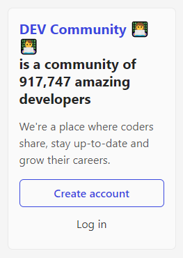

### Code

```javascript
const heading = document.querySelector(".side-bar .crayons-card h2");
heading.innerHTML = "Shubham Purwar";

const text = document.querySelector(".side-bar .crayons-card p");
text.innerHTML = "I am passionate about coding and music.";
```

### After DOM manipulation

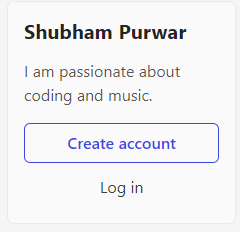

---

## Assignment 2

### Product names to be fetched

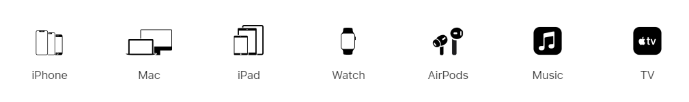

### Code

```javascript
let products = document.querySelectorAll(".as-imagegrid-item-title");
let items = [];

for (let product of products) {
  items.push(product.innerText);
}

for (let i = 0; i < items.length; i++) {
  items[i] = items[i].replace("\nSupport", "");
}

console.log(items);
```

### Output

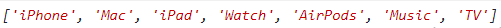

---

## Assignment 3

### Before DOM manipulation

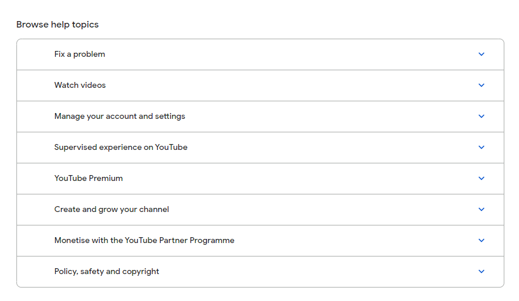

### Code

```javascript
const nav = document.getElementsByClassName("accordion-homepage")[0];

const section = document.createElement("section");
section.className = "parent";

const h3 = document.createElement("h3");
h3.textContent = "My New FAQ";

nav.appendChild(section);
section.appendChild(h3);
```

### After DOM manipulation

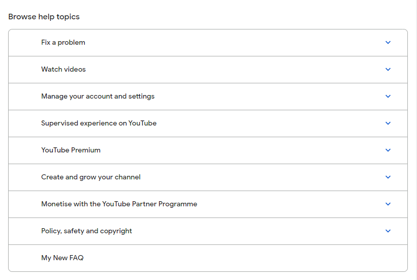

---

## Assignment 4

### Before DOM manipulation

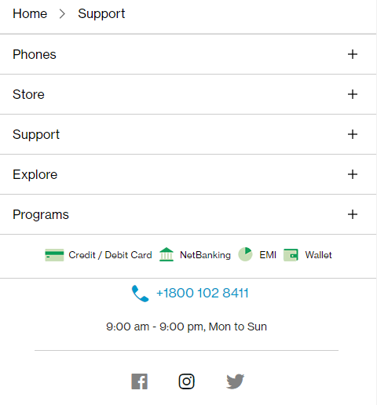

### Code

```javascript
const contactNo = document.querySelector(".one-tel-number.service-number");
contactNo.innerText = "+91 9897887871";
```

### After DOM manipulation

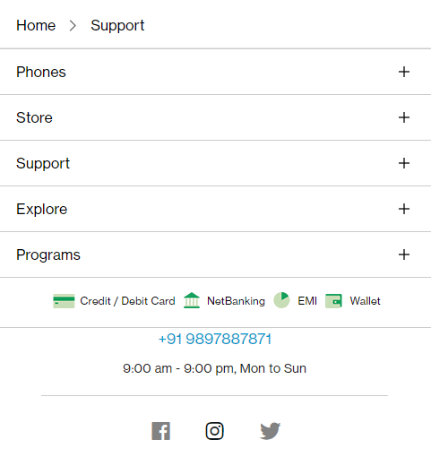

---

## Assignment 5

### Before DOM manipulation


### Code

```javascript
const buttons = document.querySelectorAll(
  ".diwali-deals-product-sale-pro-outer .diwali-deals-product-sale-btn"
);

for (let btn of buttons) {
  btn.innerText = "Check Out";
}
```

### After DOM manipulation


---

## Assignment 6

### Before DOM manipulation


### Code

```javascript
const searchBox = document.querySelector(
  ".searchinput-wrapper___3YrvF form input"
);

searchBox.addEventListener("mouseover", function () {
  this.style.backgroundColor = "red";
  this.style.border = "0px";
});

searchBox.addEventListener("mouseout", function () {
  this.style.backgroundColor = "#ECEFF1";
});
```

### After DOM manipulation


---

## Assignment 7

### Before DOM manipulation

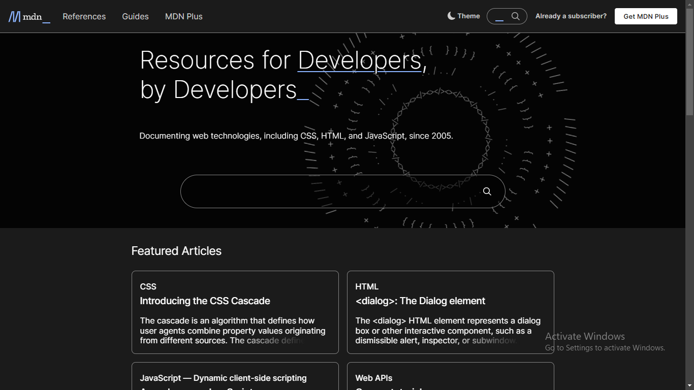

### Code

```javascript
function search(searchValue) {
  const input = document.getElementById("top-nav-search-input");
  const searchBtn = document.querySelector(
    ".button.action.has-icon.search-button"
  );

  input.focus();
  input.value = searchValue;
  searchBtn.click();
}

search("CSS Positions");
```

### After DOM manipulation

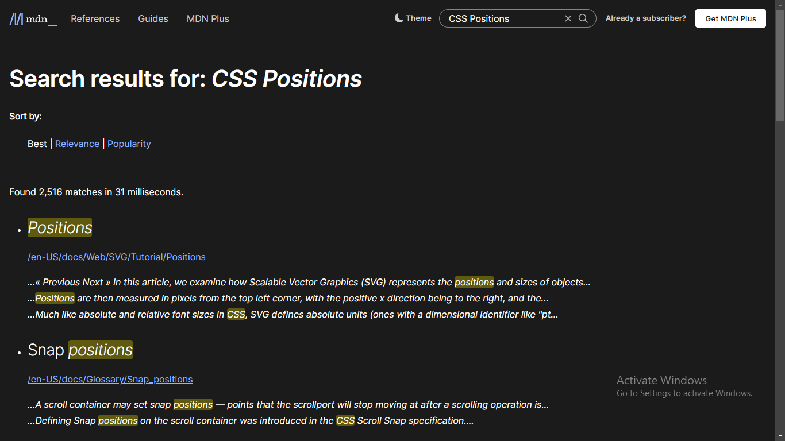

---

## Assignment 8

### Before DOM manipulation

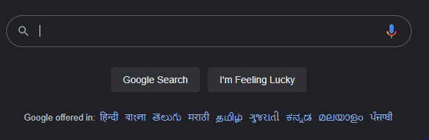

### Code

```javascript
const parent = document.getElementById("SIvCob");
const languages = document.querySelectorAll("#SIvCob a");

for (let i = 0; i < languages.length; i = i + 2) {
  parent.removeChild(languages[i]);
}
```

### After DOM manipulation

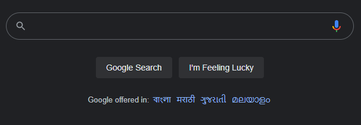

---

## Assignment 9

### Before DOM manipulation


### Code

```javascript
const heading = document.querySelector(".display-heading-1");
heading.style.fontFamily = "Monospace";
heading.style.color = "#B1361E";
```

### After DOM manipulation

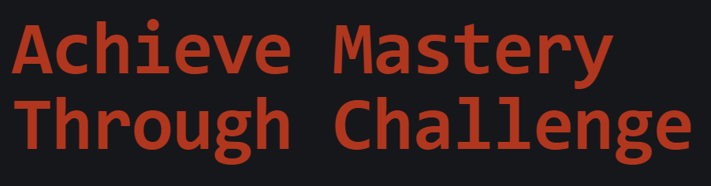

---

## Assignment 10

### Before DOM manipulation


### Code

```javascript
const btn = document.querySelector(
  ".btn-cta-big.btn-block.signup-btn.btn-cta.btn.btn-default .login-btn-text"
);

btn.addEventListener("mouseover", function () {
  this.style.backgroundColor = "red";
});

btn.addEventListener("mouseout", function () {
  this.style.background = "transparent";
});
```

### After DOM manipulation

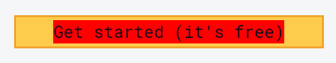

---

## Assignment 11

### Before DOM manipulation


### Code

```javascript
const logo = document.querySelector(".logo.gtag span");
logo.style.backgroundImage =
  "url('https://ineuron.ai/images/ineuron-logo.png')";
```

### After DOM manipulation


---

## Assignment 12

### Before DOM manipulation


### Code

```javascript
const btn = document.querySelector(".col-xl-4.mb-4.mb-xl-0 a");
btn.style.backgroundColor = "darkBlue";
```

### After DOM manipulation


---

## Assignment 13

### Before DOM manipulation

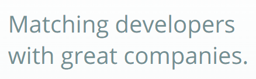

### Code

```javascript
const description = document.querySelector(".fl-heading .fl-heading-text");
description.innerHTML = "JS BOOTCAMP";
```

### After DOM manipulation


---

## Assignment 14

### Before DOM manipulation


### Code

```javascript
const heading = document.querySelector(".HotDealsAll__Heading__2fIbe");
heading.style.fontSize = "80px";
```

### After DOM manipulation


---

## Assignment 15

### Before DOM manipulation


### Code

```javascript
const headers = document.querySelectorAll(".ps-title");

for (let header of headers) {
  if (header.innerText === "G15 Gaming Laptop") {
    header.style.textAlign = "right";
  }
}
```

### After DOM manipulation


---

## Assignment 16

### Before DOM manipulation

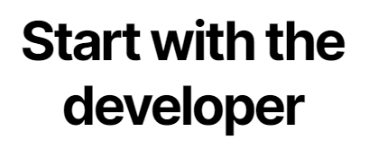

### Code

```javascript
const header = document.querySelector(".section-title_title__VEDfK");
header.textContent = "Start with Scratch";
```

### After DOM manipulation


---

## Assignment 17

### Before DOM manipulation

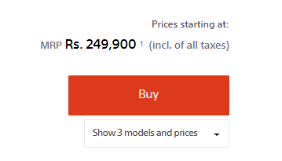

### Code

```javascript
const btn = document.querySelector(".btn-container");
btn.innerHTML = new Date().toString();
```

### After DOM manipulation

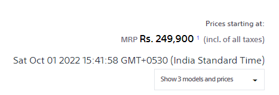

---

## Assignment 18

### Before DOM manipulation


### Code

```javascript
const footer = document.querySelector(".p-f03-footer-container");
footer.style.background = "orange";
```

### After DOM manipulation


---

## Assignment 19

### Logo to be fetched


### Code

```javascript
const logo = document.querySelector(".navbar-brand .logo");
console.log(logo.src);
```

### Output

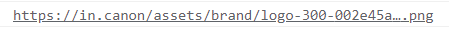

---

## Assignment 20

### Before DOM manipulation


### Code

```javascript
const description = document.querySelector(".section-box .desc");
description.style.color = "orange";
```

### After DOM manipulation


